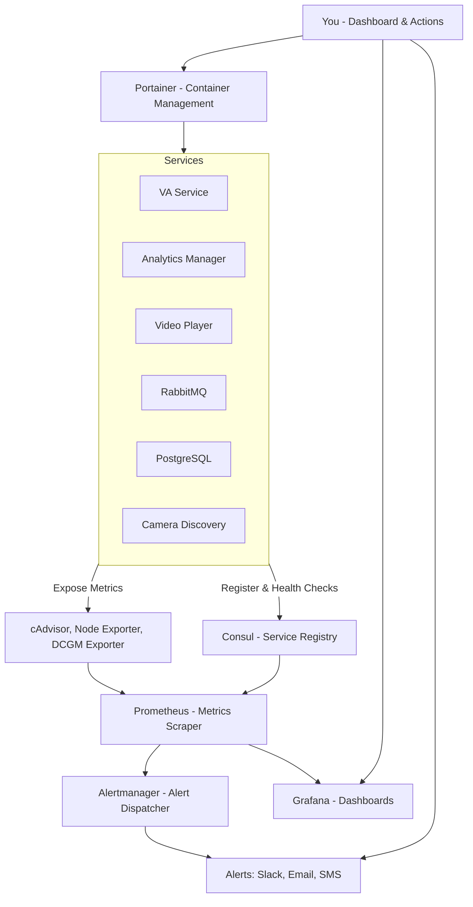

# Monitoring & Management Pipeline for Docker-Based Application

## System Overview

This pipeline monitors your Dockerized services (VA service, Analytics Manager, RabbitMQ, Postgres, Camera Discovery, etc.), collects metrics, discovers services, triggers alerts, and provides actionable dashboards and management UI.

---

## Architecture Flowchart



---

## Answers to Key Questions

| Question                         | Location / Tool                | Description                                                                                   |
|---------------------------------|-------------------------------|-----------------------------------------------------------------------------------------------|
| Where is **final data shown**?         | Grafana Dashboards            | Visualize system metrics, container health, GPU usage, and service status via Prometheus data |
| Where do services **register first**?  | Consul Service Registry       | Services register themselves here with health checks, enabling dynamic discovery by Prometheus|
| Where do you **apply actions/config**? | Portainer UI                  | Manage Docker containers — start, stop, restart, update config, view logs, exec shell         |

---

## How to Set Up This Pipeline

### 1. Run Consul (Service Registry)

```yaml
services:
  consul:
    image: consul:latest
    ports:
      - "8500:8500"
    command: "agent -dev -client=0.0.0.0"
```

### 2. Run Exporters (on each host where containers run)

```yaml
services:
  cadvisor:
    image: gcr.io/cadvisor/cadvisor:latest
    volumes:
      - /var/run/docker.sock:/var/run/docker.sock:ro
      - /sys:/sys:ro
      - /var/lib/docker/:/var/lib/docker:ro
    ports:
      - "8080:8080"
  node-exporter:
    image: quay.io/prometheus/node-exporter:latest
    network_mode: host
    pid: host
    volumes:
      - /proc:/host/proc:ro
      - /sys:/host/sys:ro
      - /:/rootfs:ro
  dcgm-exporter:
    image: nvcr.io/nvidia/k8s/dcgm-exporter:2.3.6-2.6.3-ubuntu20.04
    runtime: nvidia
    environment:
      - NVIDIA_VISIBLE_DEVICES=all
      - NVIDIA_DRIVER_CAPABILITIES=compute,utility
    volumes:
      - /var/run/docker.sock:/var/run/docker.sock
```

### 3. Run Prometheus

Basic `prometheus.yml` example with Consul service discovery:

```yaml
global:
  scrape_interval: 15s

scrape_configs:
  - job_name: 'cadvisor'
    static_configs:
      - targets: ['cadvisor:8080']

  - job_name: 'node-exporter'
    static_configs:
      - targets: ['node-exporter:9100']

  - job_name: 'dcgm-exporter'
    static_configs:
      - targets: ['dcgm-exporter:9400']

  - job_name: 'consul-services'
    consul_sd_configs:
      - server: 'consul:8500'
        services: []
```

### 4. Run Alertmanager

Basic example config `alertmanager.yml` to send email or Slack alerts:

```yaml
global:
  smtp_smarthost: 'smtp.example.com:587'
  smtp_from: 'alertmanager@example.com'
  smtp_auth_username: 'user'
  smtp_auth_password: 'pass'

route:
  receiver: 'team-email'

receivers:
  - name: 'team-email'
    email_configs:
      - to: 'team@example.com'
```

### 5. Run Grafana and Portainer

```yaml
services:
  grafana:
    image: grafana/grafana:latest
    ports:
      - "3000:3000"

  portainer:
    image: portainer/portainer-ce:latest
    ports:
      - "9000:9000"
    volumes:
      - /var/run/docker.sock:/var/run/docker.sock
```

---

## Tips

- Use **Consul** to enable dynamic discovery — no need to hardcode service IPs in Prometheus config.  
- Import **prebuilt Grafana dashboards** for cAdvisor, node-exporter, and DCGM exporter from [Grafana Dashboards](https://grafana.com/grafana/dashboards).  
- Define **Prometheus alert rules** to monitor key metrics like high GPU temperature, container restarts, or service unavailability.  
- Use **Portainer** for quick container debugging and lifecycle management.

